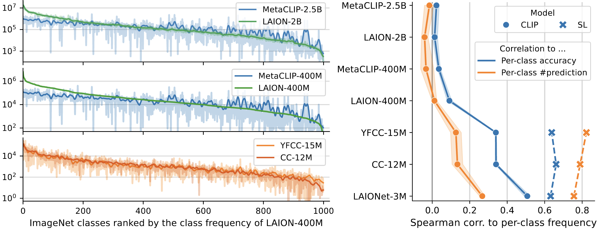

# Generalization Beyond Data Imbalance: A Controlled Study on CLIP for Transferable Insights

Legacy title: *What makes CLIP robust to pre-training data imbalance?*

By [Xin Wen](https://wen-xin.info),  [Bingchen Zhao](https://bzhao.me), [Yilun Chen](https://yilunchen.com/about/), [Jiangmiao Pang](https://oceanpang.github.io/), and [Xiaojuan Qi](https://xjqi.github.io/).

This is the official repository for the paper [Generalization Beyond Data Imbalance: A Controlled Study on CLIP for Transferable Insights](https://arxiv.org/abs/2405.21070).

## What is this paper about
Severe data imbalance naturally exists among web-scale vision-language datasets. Despite this, we find CLIP pre-trained thereupon exhibits notable robustness to the data imbalance compared to supervised learning, and demonstrates significant effectiveness in learning generalizable representations.



With an aim to investigate the reasons behind this finding, we conduct controlled experiments to study various underlying factors, and reveal that CLIP's pretext task forms a dynamic classification problem wherein only a subset of classes is present in training. This isolates the bias from dominant classes and implicitly balances the learning signal.
Furthermore, the robustness and discriminability of CLIP improve with more descriptive language supervision, larger data scale, and broader open-world concepts, which are inaccessible to supervised learning.
Our study not only uncovers the mechanisms behind CLIP's generalizability beyond data imbalance but also provides transferable insights for the research community. The findings are validated in both supervised and self-supervised learning, enabling models trained on imbalanced data to achieve CLIP-level performance on diverse recognition tasks.

## What is covered in this repo

- [x] Code for estimating concept fequency of image-text datasets → [concept_freq_utils](./concept_freq_utils/)  
- [x] Code for curating image-text dataset variants with controlled differences → [data_utils](./data_utils/)
- [x] Code for training SL/CLIP models and reporting various per-class metrics → [exps_sup](./exps_sup/) and [exps_clip](./exps_clip/)
- [x] Code for training DINO variants and transferring to downstream tasks → [exps_dino](./exps_dino/)
- [x] Code for replicating analytical figures in the paper → [fig_utils](./fig_utils/)

## How to use this repo

Clone the repo:

```bash
git clone https://github.com/CVMI-Lab/clip-beyond-tail.git && cd clip-beyond-tail
git submodule update --init --recursive  # Also necessary if we updated any submodules
```

Then please explore the subdirectories mentioned above for detailed instructions.

## Citing this work

If you find this repo useful for your research, please consider citing our paper:

```
@article{wen2024generalization,
  title={Generalization Beyond Data Imbalance: A Controlled Study on CLIP for Transferable Insights},
  author={Wen, Xin and Zhao, Bingchen and Chen, Yilun and Pang, Jiangmiao and Qi, Xiaojuan},
  journal={arXiv preprint arXiv:2405.21070},
  year={2024}
}
```

## Acknowledgment

Our codebase is inspired by and builds upon several existing publicly available codes. We express our gratitiude to the authors of [CLIP](https://github.com/openai/CLIP), [open_clip](https://github.com/mlfoundations/open_clip), [WaffleCLIP](https://github.com/ExplainableML/WaffleCLIP), [MetaCLIP](https://github.com/facebookresearch/MetaCLIP), [imagenet-captions](https://github.com/mlfoundations/imagenet-captions), [eval-on-laion](https://github.com/alishiraliGit/eval-on-laion), [detic](https://github.com/facebookresearch/detic), [swav](https://github.com/facebookresearch/swav), [dino](https://github.com/facebookresearch/dino), and [ssl-transfer](https://github.com/linusericsson/ssl-transfer).

## License
This project is licensed under the MIT License - see the [LICENSE](LICENSE) file for details.